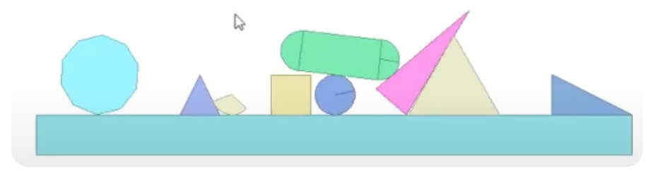
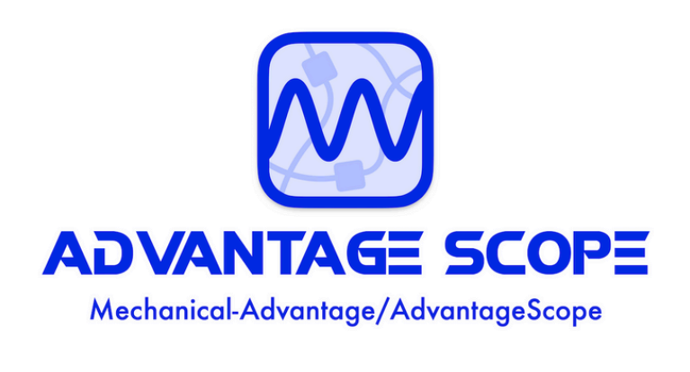

# Engineering Portfolio
---
## Hardware

+ ### Intake & Shooter
     At the beginning of the design process, we explored various schemes to optimize the intake system. Initially, we used a rubber wheel to intake the Coral, which proved highly effective. Building on this, we designed a curved structure to intake both Coral and Algae. 
     

     At the top of the robot, we installed a trapdoor with a funnel that captures the Coral from the station. Once the funnel intakes the Coral, it is sent directly to the shooter, which handles the scoring action. Additionally, the back of the shooter is curved to grab the Algae from the reef.This innovative design ensures we can intake both types of game elements. The shooter can also reverse its rotation to hang the Coral on the reef. 
     

     To further enhance efficiency and accuracy, we integrated four cameras working with four Orange Pi devices to recognize the field's QR Codes, allowing for precise location tracking. 
     

     Furthermore, we included an "Elevator" mechanism that raises the shooter to Level 4, giving us access to the highest point in the competition. Additionally, the shooter is equipped to drop the Algae into the net. 
---
+ ### Climb
     Catching the cage presented a significant challenge, so we designed two hooks to securely latch onto the cage.Before catching the cage, the trapdoor opens, raising the hooks to help lift our robot off the ground and achieve the Climbing score. 
     

     To ensure we could effectively catch the cage, we used a number of carbon fiber components to reduce the weight of the robot, making it both lightweight and strong for the task. 

---
## Software

+ ### Driving system & Auto
    In this season, we have focused our software development on simulation technology and the autonomous capabilities of robots. Before the machines were completed, we spent nearly a month developing a simulation engine capable of fully replicating the physical characteristics of real machines. Thanks to this special technology, we were able to develop a semi-autonomous driving system that almost frees up both hands and a stable, self-decision-making autonomous system within a week after the machines were completed.Simulation Technology

+ ### Simulation Technology
    Simulation technology refers to using physics engines to emulate the characteristics of real machines, allowing software testing to commence before the machine is finished. In FRC, it is not a new technology; many teams already use simulation to test program logic. However, currently, simulators can only handle relatively simple simulations, such as simulating the gravity of a single arm or lift.   And our simulator uses a more comprehensive open-source physics engine, dyn4j. It can not only simulate gravity and friction but also perform collision simulations for objects.   Additionally, we use the open-source project AdvantageScope from Team 6328 in the USA.
    